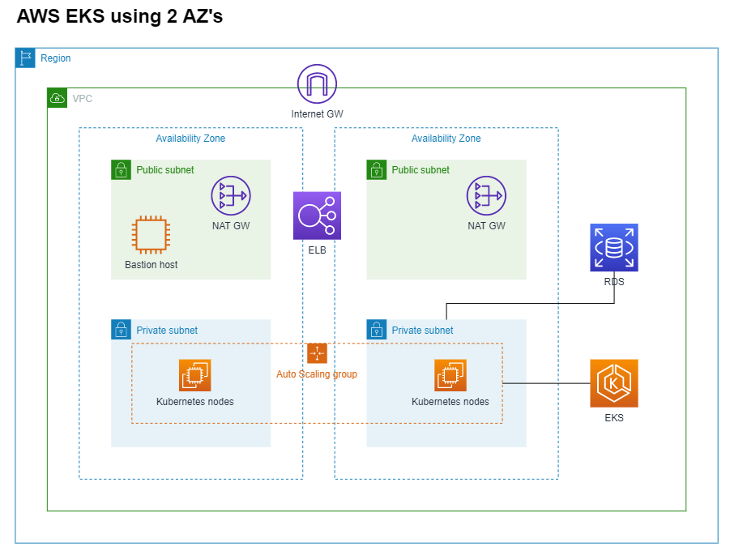
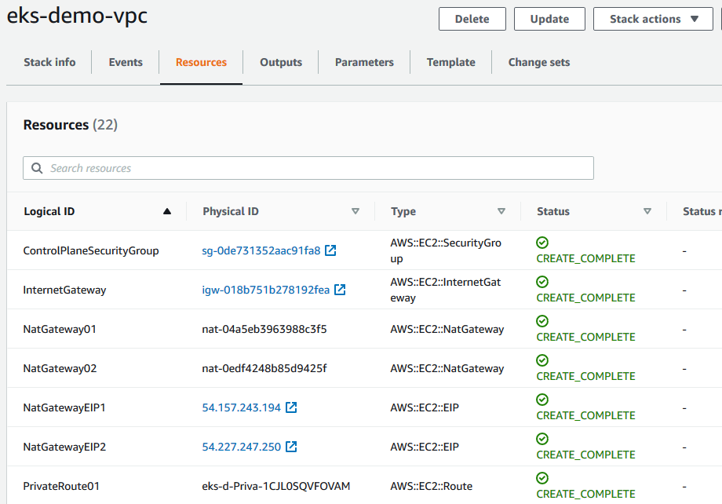
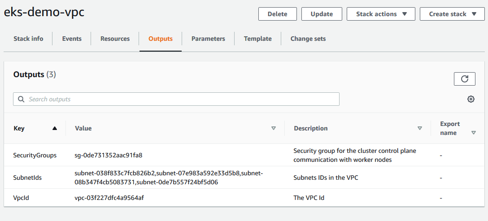
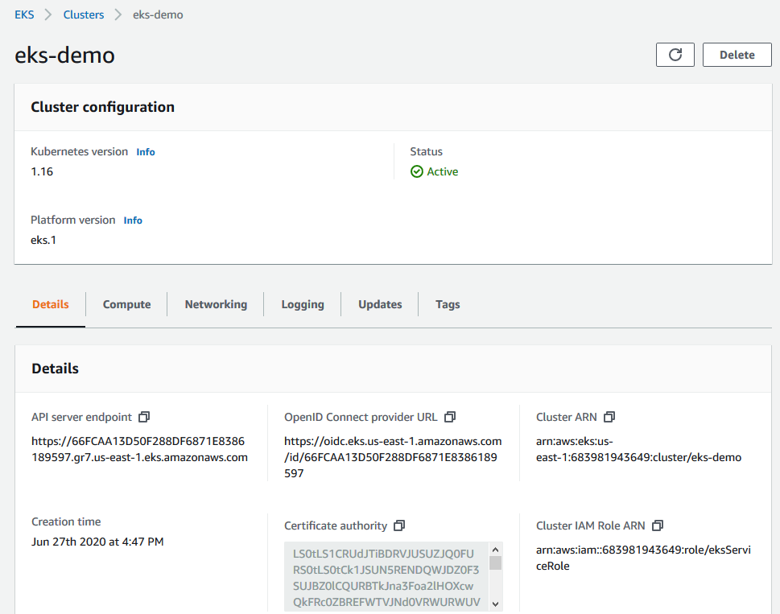

# AWS EKS Demo

This is a sample EKS Cluster created using CloudFormation. CFN templates are also used to create the VPC with Public and Private Subnets.

NOTE: EKS Cluster and NAT GW are charged per hour. To avoid charges in your AWS account, remember to delete the stacks you created once you are done.

## Create VPC for EKS Cluster

Create VPC using CloudFormation\
https://docs.aws.amazon.com/eks/latest/userguide/create-public-private-vpc.html

CloudFormation template with public and private subnets:\
https://amazon-eks.s3.us-west-2.amazonaws.com/cloudformation/2020-06-10/amazon-eks-vpc-private-subnets.yaml

You may use the CloudFormation template above as a guide and modify according to your requirements.

For this example, I have modified the VPC CIDR and Subnets:

VPC CIDR: 172.29.0.0/16\
Public Subnets: 172.29.1.0/24, 172.29.2.0/24\
Private Subnets: 172.29.3.0/24, 172.29.4.0/24

CFN Template: [cfn-vpc-pub-pri.yaml](cfn-vpc-pub-pri.yaml)

1. Go to CloudFormation and Create stack
2. Upload template and continue
3. Enter Stack name: eks-demo-vpc 
4. Configure stack options: leave defaults and continue
5. Review and create stack

Your stack will have a status of "CREATE_COMPLETE" after all resources have been provisioned.

Review the stack by clicking on the Resources and Ouputs tabs.

You will need the SecurityGroupId and SubnetIds to create the EKS Cluster.

## Create EKS Cluster

Creating an Amazon EKS cluster (general guide)\
https://docs.aws.amazon.com/eks/latest/userguide/create-cluster.html

Create EKS Cluster using CloudFormation\
https://docs.aws.amazon.com/AWSCloudFormation/latest/UserGuide/aws-resource-eks-cluster.html

CFN Template: [cfn-eks-cluster.yaml](cfn-eks-cluster.yaml)

1. Go to CloudFormation and Create stack
2. Upload template and continue
3. Enter Stack name: eks-cluster
4. Configure stack options: leave defaults and continue
5. Review and create stack

## Create EKS Worker Nodes

## Clean Up
