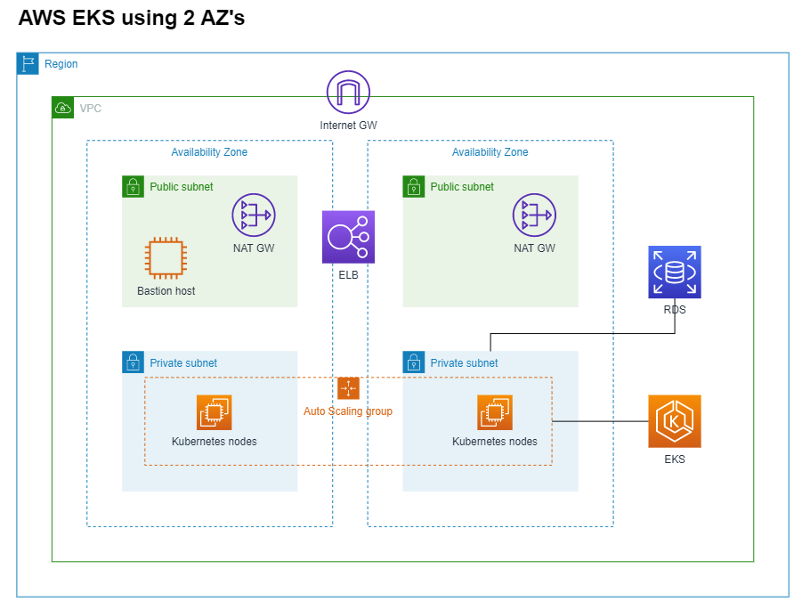
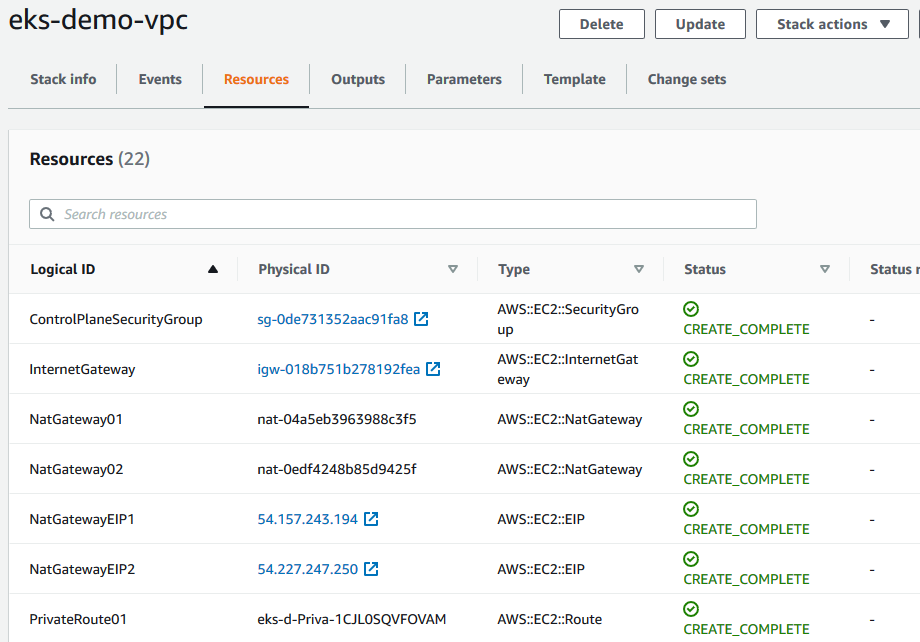
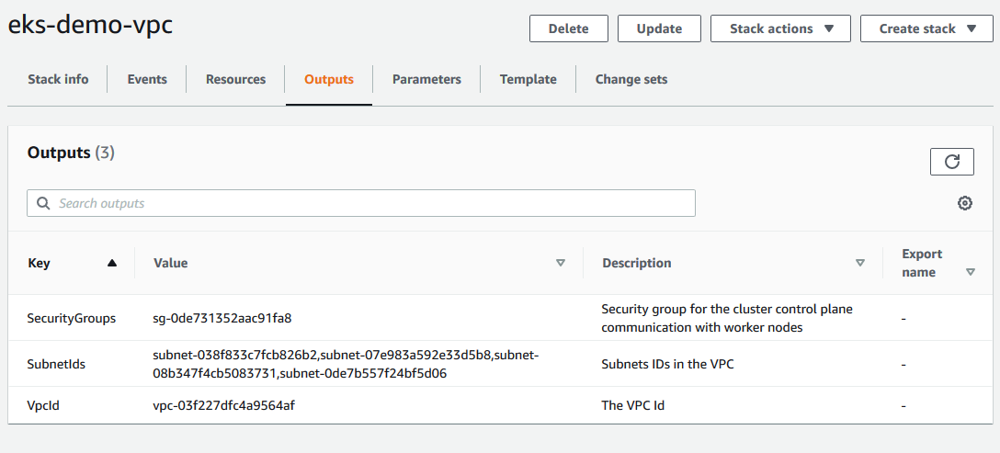
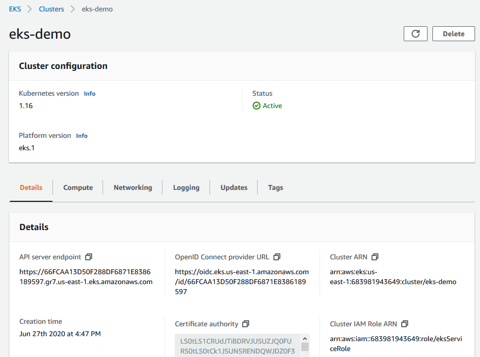
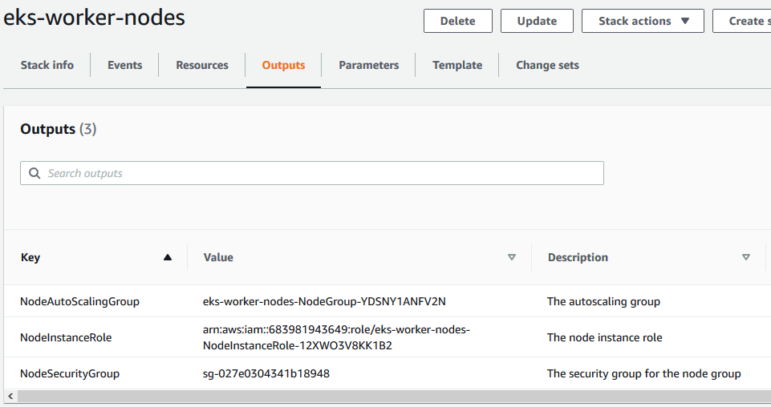
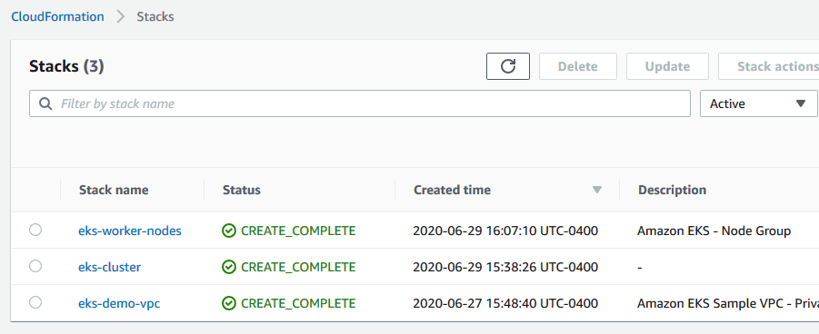

# AWS EKS Demo

This demo will be using CoudFormation (CFN) templates to create the EKS Cluster, Worker Nodes, VPC, Subnets and other network resources.

**NOTE:** EKS Cluster and NAT Gateways are charged per hour after being provisioned. To avoid unexpected charges in your AWS account, remember to delete the stacks you created once you are done.



Estimated cost for EKS Cluster, 2 NAT Gateways and 2 Worker nodes (t3.micro):\
*(Excluding EBS volume and data transfer costs)*

Provisioned Cost | Per Hour 
-----------------|----------
EKS Cluster | $0.10 
NAT Gateway | $0.045 x 2 
Worker Node (t3.micro) | $0.0104 x 2 
**Total (estimate)** | **$0.21** 

---

## Create VPC for EKS Cluster

Create VPC using CloudFormation\
https://docs.aws.amazon.com/eks/latest/userguide/create-public-private-vpc.html

CloudFormation template with public and private subnets:\
https://amazon-eks.s3.us-west-2.amazonaws.com/cloudformation/2020-06-10/amazon-eks-vpc-private-subnets.yaml

You may use the CloudFormation template above as a guide and modify according to your requirements.

For this demo, the VPC CIDR and Subnets were modified to use the following:

VPC CIDR: 172.29.0.0/16\
Public Subnets: 172.29.1.0/24, 172.29.2.0/24\
Private Subnets: 172.29.3.0/24, 172.29.4.0/24

Other network resources such as Internet GW, NAT GW, Route Tables and SecurityGroup for the control plane will be created as well.

CFN Template: [cfn-vpc-pub-pri.yaml](cfn-vpc-pub-pri.yaml)

1. Open CloudFormation and Create stack
2. Choose template to upload and continue
3. Enter Stack name: eks-demo-vpc 
4. Configure stack options: leave defaults and continue
5. Review and create stack

Your stack will have a status of "CREATE_COMPLETE" after all resources have been provisioned.

Review the stack by clicking on the Resources and Ouputs tabs.



You will need the SecurityGroupId and SubnetIds to create the EKS Cluster.




## Create EKS Cluster

Creating an Amazon EKS cluster (general guide)\
https://docs.aws.amazon.com/eks/latest/userguide/create-cluster.html

Create EKS Cluster using CloudFormation\
https://docs.aws.amazon.com/AWSCloudFormation/latest/UserGuide/aws-resource-eks-cluster.html

Some requirements that you may need to create in advance:
- EKS cluster IAM role\
  (Role Name: eksServiceRole)\
  https://docs.aws.amazon.com/eks/latest/userguide/service_IAM_role.html
- Key Pair for the Worker Nodes\
 (Key Name: eks-node)\
  https://docs.aws.amazon.com/servicecatalog/latest/adminguide/getstarted-keypair.html

CFN Template: [cfn-eks-cluster.yaml](cfn-eks-cluster.yaml)

1. Open CloudFormation and Create stack
2. Choose template to upload and continue
3. Enter Stack name: eks-cluster
4. Configure stack options: leave defaults and continue
5. Review and create stack

Cluster status will show "Active" once provisioned. Then you may proceed creating the worker nodes.




## Create EKS Worker Nodes

This demo will be using Self-managed nodes. For more information on Worker Nodes, see:
https://docs.aws.amazon.com/eks/latest/userguide/worker.html

Launching Amazon EKS Linux worker nodes (self-managed)\
https://docs.aws.amazon.com/eks/latest/userguide/launch-workers.html#self-managed-nodes

You may use this CloudFormation template as a guide and modify according to your requirements:\
https://amazon-eks.s3.us-west-2.amazonaws.com/cloudformation/2020-06-10/amazon-eks-nodegroup.yaml

CFN Template: [cfn-eks-worker-nodes.yaml](cfn-eks-worker-nodes.yaml)

1. Open CloudFormation and Create stack
2. Choose template to upload and continue
3. Enter Stack name: eks-worker-nodes
4. Configure stack options: leave defaults and continue
5. Review and create stack

Review the Outputs tab and take note of the NodeInstanceRole, this will be needed to allow the worker nodes to join the cluster.



## Join Worker Nodes to the EKS Cluster

Launch a bastion host following security best practices. Install the necessary tools and configure access to the cluster.

- Install AWS CLI version 2:\
  https://docs.aws.amazon.com/cli/latest/userguide/install-cliv2-linux.html
  
  ```
  sudo yum update -y
  curl "https://awscli.amazonaws.com/awscli-exe-linux-x86_64.zip" -o "awscliv2.zip"
  unzip awscliv2.zip
  sudo ./aws/install
  aws --version
  # Run "aws configure" with your credentials
  aws sts get-caller-identity
  ```

- Install kubectl:\
  https://docs.aws.amazon.com/eks/latest/userguide/install-kubectl.html

  ```
  curl -o kubectl https://amazon-eks.s3.us-west-2.amazonaws.com/1.16.8/2020-04-16/bin/linux/amd64/kubectl
  chmod +x ./kubectl
  mkdir -p $HOME/bin && cp ./kubectl $HOME/bin/kubectl && export PATH=$PATH:$HOME/bin
  echo 'export PATH=$PATH:$HOME/bin' >> ~/.bashrc
  kubectl version --short --client
  ```

- Create kubeconfig:\
  https://docs.aws.amazon.com/eks/latest/userguide/create-kubeconfig.html
  
  ```
  aws eks --region us-east-1 update-kubeconfig --name eks-demo
  # By default, kubeconfig will be created in ~/.kube/config
  kubectl get svc
  ```

- Add user role:\
  https://docs.aws.amazon.com/eks/latest/userguide/add-user-role.html
  
  ```
  curl -o aws-auth-cm.yaml https://amazon-eks.s3.us-west-2.amazonaws.com/cloudformation/2020-06-10/aws-auth-cm.yaml
  vi aws-auth-cm.yaml # modify rolearn using the NodeInstanceRole from the previous section.
  kubectl apply -f aws-auth-cm.yaml
  kubectl describe configmap -n kube-system aws-auth
  ```

At this point you should be able to run kubectl commands in your cluster.
```
[ec2-user@ip-172-29-1-176 .kube]$ kubectl get svc
NAME         TYPE        CLUSTER-IP   EXTERNAL-IP   PORT(S)   AGE
kubernetes   ClusterIP   10.100.0.1   <none>        443/TCP   163m

[ec2-user@ip-172-29-1-176 .kube]$ kubectl get nodes
NAME                           STATUS   ROLES    AGE   VERSION
ip-172-29-3-40.ec2.internal    Ready    <none>   46m   v1.16.8-eks-e16311
ip-172-29-4-218.ec2.internal   Ready    <none>   46m   v1.16.8-eks-e16311

[ec2-user@ip-172-29-1-176 .kube]$ kubectl get pods --all-namespaces
NAMESPACE     NAME                       READY   STATUS    RESTARTS   AGE
kube-system   aws-node-29rht             1/1     Running   0          46m
kube-system   aws-node-lt7qd             1/1     Running   0          46m
kube-system   coredns-55c5fcd78f-t9rdl   1/1     Running   0          164m
kube-system   coredns-55c5fcd78f-txlxr   1/1     Running   0          164m
kube-system   kube-proxy-nfthl           1/1     Running   0          46m
kube-system   kube-proxy-wdgjw           1/1     Running   0          46m
```

**Congratulations! You now have a working Kubernetes cluster and start deploying applications.**

## Cleanup

Open CloudFormation > Stacks:



Delete each of the stack you have created in the following order:

1. eks-worker-nodes 
2. eks-cluster
3. eks-demo-vpc

Delete the bastion host ec2 instance.

---

## Scaling Considerations

- Cluster Autoscaler\
  https://docs.aws.amazon.com/eks/latest/userguide/cluster-autoscaler.html

- Horizontal Pod Autoscaler (HPA)\
  https://docs.aws.amazon.com/eks/latest/userguide/horizontal-pod-autoscaler.html

- Scheduled Scaling\
  https://docs.aws.amazon.com/autoscaling/ec2/userguide/schedule_time.html

- Multi-Tenant (Namespaces) or Multi-Cluster\
  https://aws.amazon.com/blogs/containers/multi-tenant-design-considerations-for-amazon-eks-clusters/ 

- Subnet Sizing/Optimization\
  https://docs.aws.amazon.com/eks/latest/userguide/eks-networking.html\
  https://medium.com/@savvythrough/aws-eks-subnet-ip-optimization-67b7ac83124e
